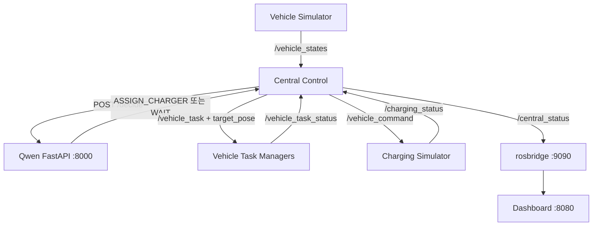

# AIoT EV 충전 중앙관제 · Qwen 연동 파이프라인

> 팀 공유용 운영 문서  
> 기준 환경: Ubuntu 22.04, ROS 2 Humble, Python 3.10, 단일 PC의 `~/aiot_ws` 워크스페이스  
> 문서 기준일: 2026-08-21

## 1. 현재 구현 범위

이 프로젝트는 여러 전기차의 상태를 중앙관제가 수집하고, Qwen이 충전 우선 차량을 선택하면 해당 차량에 **충전기로 이동하라는 목표 좌표 기반 작업**을 전달하는 파이프라인이다.

현재 동작하는 범위는 다음과 같다.

- 차량 시뮬레이터가 `/vehicle_states`에 EV01~EV03 상태를 발행한다.
- 중앙관제가 차량 및 충전기 상태를 관리한다.
- 중앙관제가 Qwen HTTP 서버의 `/decide` API에 현재 상태를 전송한다.
- Qwen 응답을 검증하고, 응답 실패 또는 형식 오류 시 규칙 기반 스케줄러로 자동 전환한다.
- 선택된 차량에 `/vehicle_task` 작업을 발행한다.
- 차량별 Task Manager가 작업을 수락하고 이동 상태 및 도착 상태를 `/vehicle_task_status`로 보고한다.
- 중앙관제는 `ARRIVED_AT_CHARGER` 확인 후에만 `/vehicle_command`로 `START_CHARGING`을 보낸다.
- 충전 시뮬레이터가 SOC를 갱신하고 완료 시 충전기를 해제한다.
- `/central_status`가 전체 상태, 최근 결정, 목표 좌표 및 이벤트 이력을 1 Hz로 제공한다.
- rosbridge와 웹 대시보드를 통해 브라우저에서 실시간 상태를 볼 수 있다.
- 이벤트는 `~/.ros/aiot_charging_history.jsonl`에 영속 저장된다.

아직 실제 차량 플래너/Nav2와 연결된 상태는 아니다. 차량 이동은 차량별 Task Manager의 타이머로 모사한다.

## 2. 전체 구조



핵심 설계 원칙은 중앙관제가 차량의 바퀴나 조향을 직접 제어하지 않는다는 것이다. 중앙관제는 차량 ID, 행동, 목적지 좌표를 전달하고 차량 측 플래너가 이동을 수행한다. 현재는 플래너 대신 시간 기반 Task Manager가 동일한 인터페이스를 시험한다.

## 3. 주요 구성요소

| 구성요소 | 역할 | 주요 인터페이스 |
| --- | --- | --- |
| `qwen_server.py` | 4-bit Qwen 모델 로드 및 충전 순서 결정 API 제공 | HTTP `:8000/health`, `:8000/decide` |
| `central_control_node.py` | 상태 취합, Qwen 호출, 응답 검증, fallback, 작업 배차 | ROS 토픽 6종 |
| `vehicle_simulator_node.py` | EV01~EV03 상태 생성 | `/vehicle_states` |
| `vehicle_task_manager_node.py` | 차량별 작업 수락 및 이동/도착 피드백 | `/vehicle_task`, `/vehicle_task_status` |
| `charging_simulator_node.py` | 충전 시작 명령 수신, SOC 증가 및 완료 보고 | `/vehicle_command`, `/charging_status` |
| `fleet_locations.yaml` | 충전기와 차량별 주차 목표 좌표 | ROS 파라미터 |
| `central_control.launch.py` | 시뮬레이터, 차량별 Task Manager, 중앙관제를 일괄 실행 | `ros2 launch` |
| `aiot_charging_dashboard.html` | 중앙 상태와 이벤트 시각화 | rosbridge WebSocket |

## 4. 디렉터리 배치

기준 디렉터리 구조는 다음과 같다.

```text
~/aiot_ws/
├── src/
│   └── aiot_central_control/
│       ├── aiot_central_control/
│       │   ├── core/
│       │   ├── models/
│       │   └── nodes/
│       │       ├── central_control_node.py
│       │       ├── vehicle_simulator_node.py
│       │       ├── charging_simulator_node.py
│       │       └── vehicle_task_manager_node.py
│       ├── config/
│       │   └── fleet_locations.yaml
│       ├── launch/
│       │   └── central_control.launch.py
│       ├── package.xml
│       └── setup.py
├── qwen_server/
│   └── qwen_server.py
└── dashboard/
    └── index.html
```

`src` 파일을 수정한 뒤에는 반드시 다시 빌드하고 `install/setup.bash`를 source한다. 실행 중인 노드는 자동으로 새 코드를 읽지 않으므로 재시작해야 한다.

## 5. Conda 환경 설명

이 프로젝트에서 확인된 Conda 환경은 `qwen-control`과 `qwen-quant`이다. 이름만으로 실행 환경을 추측하지 말고 아래 import 점검으로 실제 패키지 설치 상태를 먼저 확인한다.

### 5.1 권장 역할 분리

| 환경 | 권장 역할 | 필요한 주요 패키지 |
| --- | --- | --- |
| `qwen-quant` | Qwen 4-bit 모델 서버 전용 | `torch`, `transformers`, `accelerate`, `bitsandbytes`, `fastapi`, `uvicorn`, `pydantic` |
| `qwen-control` | API 시험, 중앙관제 보조 Python 도구 | `requests`, `fastapi`, `uvicorn`, `pydantic` |
| 시스템 Python + ROS setup | ROS 2 노드와 launch 실행 | ROS 2 Humble, `rclpy`, 패키지 의존성 |

현재 개발 화면에서는 `qwen-control` 환경에서도 Qwen3.5-4B 4-bit 모델 서버가 정상 로드된 이력이 있다. 즉, 현재 PC에서는 모델 패키지가 `qwen-control`에 함께 설치되어 있을 수 있다. 팀원 PC에서는 **아래 점검이 성공하는 환경을 Qwen 서버용으로 선택**하면 된다.
```bash
conda env list

conda activate qwen-control
python -c "import torch, transformers, accelerate, bitsandbytes, fastapi, uvicorn; print('qwen-control OK')"

conda activate qwen-control
python -c "import requests, fastapi, uvicorn; print('qwen-control OK')"
```

Qwen 모델 import가 `qwen-quant`에서는 실패하고 `qwen-control`에서만 성공한다면, 현재 구성 그대로 `qwen-control`에서 서버를 실행한다. 반대로 역할이 정상 분리되어 있으면 `qwen-quant`를 사용한다.
#### qwen-control로 맞춰놨으니, qwen-control만 사용하기.

### 5.2 환경을 새로 만드는 경우

CUDA와 PyTorch 조합은 PC의 GPU 드라이버에 맞춰야 한다. 아래는 프로젝트에 필요한 패키지 범위를 보여 주는 예시이며, PyTorch 설치 명령은 팀 PC의 CUDA 버전에 맞게 조정한다.

```bash
conda create -n qwen-quant python=3.10 -y
conda activate qwen-quant

# PyTorch는 https://pytorch.org 의 해당 CUDA 명령으로 먼저 설치
python -m pip install transformers accelerate bitsandbytes
python -m pip install fastapi "uvicorn[standard]" pydantic
```

```bash
conda create -n qwen-control python=3.10 -y
conda activate qwen-control
python -m pip install requests fastapi "uvicorn[standard]" pydantic
```

팀원에게 정확히 같은 환경을 전달하려면 원본 PC에서 다음 파일을 생성해 함께 공유한다.

```bash
conda env export -n qwen-quant --from-history > environment-qwen-quant.yml
conda env export -n qwen-control --from-history > environment-qwen-control.yml
```

팀원은 다음처럼 복원할 수 있다.

```bash
conda env create -f environment-qwen-quant.yml
conda env create -f environment-qwen-control.yml
```

### 5.3 ROS와 Conda 충돌 주의

ROS 2 Humble의 `rclpy`는 시스템 Python 3.10을 기준으로 설치된다. Conda 환경의 Python 버전이나 라이브러리 경로가 다르면 `rclpy` import 오류가 날 수 있다. 가장 안전한 실행 방식은 다음과 같다.

- Qwen 서버 터미널: `qwen-quant` 또는 실제 모델 패키지가 설치된 Conda 환경 사용
- ROS launch 및 rosbridge 터미널: Conda를 비활성화하고 ROS setup 사용
- 대시보드 HTTP 서버: 시스템 Python 또는 어느 환경이든 사용 가능

```bash
conda deactivate
source /opt/ros/humble/setup.bash
source ~/aiot_ws/install/setup.bash
```

## 6. 최초 설치 및 빌드

### 6.1 ROS 의존성

```bash
sudo apt update
sudo apt install -y \
  ros-humble-rosbridge-server \
  python3-colcon-common-extensions \
  python3-requests
```

패키지 의존성을 `package.xml`에 선언했다면 다음 명령도 실행한다.

```bash
cd ~/aiot_ws
rosdep install --from-paths src --ignore-src -r -y
```

### 6.2 파일 배치 확인

```bash
test -f ~/aiot_ws/qwen_server/qwen_server.py && echo "Qwen server OK"
test -f ~/aiot_ws/src/aiot_central_control/launch/central_control.launch.py && echo "Launch OK"
test -f ~/aiot_ws/src/aiot_central_control/config/fleet_locations.yaml && echo "Goal config OK"
test -f ~/aiot_ws/dashboard/index.html && echo "Dashboard OK"
```

### 6.3 ROS 패키지 빌드

```bash
cd ~/aiot_ws
source /opt/ros/humble/setup.bash

colcon build \
  --packages-select aiot_central_control \
  --symlink-install

source ~/aiot_ws/install/setup.bash
```

빌드 산출물에 설정과 실행 파일이 포함됐는지 확인한다.

```bash
ros2 pkg executables aiot_central_control
ls ~/aiot_ws/install/aiot_central_control/share/aiot_central_control/launch
ls ~/aiot_ws/install/aiot_central_control/share/aiot_central_control/config
```

## 7. 목표 좌표 설정

목표 좌표는 다음 파일에서 관리한다.

```text
~/aiot_ws/src/aiot_central_control/config/fleet_locations.yaml
```

현재 예시 값은 다음과 같다.

```yaml
central_control_node:
  ros__parameters:
    # map frame 기준, yaw 단위는 rad
    charger_01_pose: [10.0, 5.0, 0.0]

    ev01_parking_pose: [0.0, 0.0, 0.0]
    ev02_parking_pose: [0.0, 2.0, 0.0]
    ev03_parking_pose: [0.0, 4.0, 0.0]
```

각 배열은 `[x, y, yaw]` 순서다. 현재 중앙관제는 `charger_01_pose`를 `/vehicle_task`의 `target_pose`로 전달한다. 주차 좌표는 향후 충전 완료 후 `RETURN_TO_PARKING` 작업에 사용할 준비가 되어 있으나, 중앙관제의 자동 복귀 배차는 아직 구현 대상이다.

좌표 변경 후에는 다시 빌드하고 launch를 재시작한다.

```bash
cd ~/aiot_ws
colcon build --packages-select aiot_central_control --symlink-install
source ~/aiot_ws/install/setup.bash
ros2 launch aiot_central_control central_control.launch.py
```

적용값 확인:

```bash
ros2 param get /central_control_node charger_01_pose
ros2 param get /central_control_node ev01_parking_pose
```

## 8. 전체 실행 순서

아래 순서를 권장한다. 총 4개의 터미널을 사용한다.

### 터미널 1 — Qwen 서버

먼저 모델 패키지가 설치된 환경을 활성화한다. 권장 환경은 `qwen-quant`이지만, 현재 PC에서 `qwen-control`에만 모델 패키지가 설치되어 있다면 그 환경을 사용한다.

```bash
현재 설치가 `qwen-control`에 묶여 있는 경우:

```bash
conda activate qwen-control
cd ~/aiot_ws/qwen_server
python -m uvicorn qwen_server:app --host 127.0.0.1 --port 8000
```

정상 로그 예시:

```text
Loading Qwen3.5-4B 4-bit...
Qwen loaded.
GPU memory allocated: 약 2.9 GB
Uvicorn running on http://127.0.0.1:8000
```

`qwen_server.py`가 있는 디렉터리에서 실행하는 것이 중요하다. 다른 디렉터리에 같은 이름의 모듈이나 폴더가 있으면 잘못 import되어 `Attribute "app" not found in module "qwen_server"`가 발생할 수 있다.

### 터미널 2 — ROS 중앙관제 파이프라인

```bash
이건 반드시 로컬에서 실행
source /opt/ros/humble/setup.bash
source ~/aiot_ws/install/setup.bash

ros2 launch aiot_central_control central_control.launch.py
```

이 launch는 다음 노드를 실행한다.

- `vehicle_simulator_node`
- `charging_simulator_node`
- `vehicle_task_manager_ev01` — 이동 모사 5초
- `vehicle_task_manager_ev02` — 이동 모사 6초
- `vehicle_task_manager_ev03` — 이동 모사 7초
- `central_control_node`

차량별 Task Manager를 launch가 이미 실행하므로 별도로 또 실행하면 안 된다. 중복 실행 시 같은 작업에 대한 `ACCEPTED`, `MOVING_TO_CHARGER`, `ARRIVED_AT_CHARGER`가 두 번씩 나타난다.

### 터미널 3 — rosbridge

```bash
이건 반드시 로컬에서 실행
source /opt/ros/humble/setup.bash
source ~/aiot_ws/install/setup.bash

ros2 launch rosbridge_server rosbridge_websocket_launch.xml
```

정상 로그:

```text
Rosbridge WebSocket server started on port 9090
```

Humble에서 Jazzy 이후 기본값 변경에 관한 timeout/thread 경고가 나와도 WebSocket 시작 로그가 있으면 현재 대시보드 연결에는 문제가 없다.

### 터미널 4 — 대시보드 HTTP 서버

```bash
이건 반드시 로컬에서 실행
cd ~/aiot_ws/dashboard
python3 -m http.server 8080 --bind 127.0.0.1
```

Chrome에서 다음 주소를 연다.

```text
http://127.0.0.1:8080/
```

브라우저가 `/favicon.ico`에 404를 출력하는 것은 대시보드 기능과 무관하다. 화면 우측 상단의 `ROS2 연결됨` 표시와 실시간 SOC 변화를 확인한다.

## 9. Qwen API 사용법

### 9.1 상태 확인

```bash
curl -s http://127.0.0.1:8000/health
```

HTTP 200이 나와야 한다.

```bash
curl -i http://127.0.0.1:8000/health
```

### 9.2 `/decide` 요청 형식

최상위 JSON에는 `vehicles`와 `chargers`가 모두 필요하다. 다음은 유효한 최소 시험 요청이다.

```bash
curl -s -X POST http://127.0.0.1:8000/decide \
  -H 'Content-Type: application/json' \
  -d '{
    "vehicles": [
      {
        "vehicle_id": "EV01",
        "soc": 30.0,
        "target_soc": 80.0,
        "departure_minutes": 90.0
      },
      {
        "vehicle_id": "EV02",
        "soc": 50.0,
        "target_soc": 70.0,
        "departure_minutes": 30.0
      }
    ],
    "chargers": [
      {
        "charger_id": "CHARGER_01",
        "power_kw": 50.0,
        "state": "AVAILABLE"
      }
    ]
  }' | python3 -m json.tool
```

응답 예시:

```json
{
  "action": "ASSIGN_CHARGER",
  "vehicle_id": "EV02",
  "charger_id": "CHARGER_01",
  "reason": "LOW_SLACK_TIME"
}
```

또는 충전 배차를 보류할 경우:

```json
{
  "action": "WAIT",
  "reason": "NO_URGENT_VEHICLE"
}
```

### 9.3 422 오류 의미

`POST /decide`의 `422 Unprocessable Entity`는 Qwen 연동 실패가 아니라 FastAPI/Pydantic 입력 검증 실패다. 요청 본문에 필수 필드가 빠졌거나 이름/자료형이 API 스키마와 다르다는 뜻이다.

현재 필수 필드:

- 최상위: `vehicles`, `chargers`
- 차량: `vehicle_id`, `soc`, `target_soc`, `departure_minutes`
- 충전기: `charger_id`, `power_kw`, `state`

상세 오류 확인:

```bash
curl -s -X POST http://127.0.0.1:8000/decide \
  -H 'Content-Type: application/json' \
  -d '{}' | python3 -m json.tool
```

서버가 실제로 요구하는 최신 스키마는 다음으로 확인한다.

```bash
curl -s http://127.0.0.1:8000/openapi.json \
  | python3 -c 'import sys,json; d=json.load(sys.stdin); print(json.dumps(d["components"]["schemas"], indent=2, ensure_ascii=False))'
```

## 10. ROS 토픽 계약

현재 모든 애플리케이션 데이터 토픽은 `std_msgs/msg/String` 안에 JSON을 넣는 방식이다.

| 토픽 | 발행 → 구독 | 목적 |
| --- | --- | --- |
| `/vehicle_states` | 차량 시뮬레이터 → 중앙관제 | 차량 위치, SOC, 출발 시각, 상태 |
| `/vehicle_task` | 중앙관제 → 차량 Task Manager | 행동과 목표 좌표 전달 |
| `/vehicle_task_status` | 차량 Task Manager → 중앙관제 | 수락, 이동, 도착, 거절 피드백 |
| `/vehicle_command` | 중앙관제 → 충전 시뮬레이터 | 도착 확인 후 `START_CHARGING` 전달 |
| `/charging_status` | 충전 시뮬레이터 → 중앙관제 | SOC와 `CHARGING`/`CHARGE_COMPLETE` |
| `/central_status` | 중앙관제 → 대시보드 | 전체 시스템 스냅샷과 이벤트 |

### 10.1 `/vehicle_task` 예시

```json
{
  "task_id": "TASK_EV02_1787232253186082491",
  "action": "MOVE_TO_CHARGER",
  "vehicle_id": "EV02",
  "target_id": "CHARGER_01",
  "target_pose": {
    "x": 10.0,
    "y": 5.0,
    "yaw": 0.0
  },
  "reason": "LOW_SLACK_TIME"
}
```

### 10.2 `/vehicle_task_status` 상태 전이

```text
ACCEPTED
  → MOVING_TO_CHARGER
  → ARRIVED_AT_CHARGER
```

상태 메시지에는 `task_id`, `vehicle_id`, `state`, `accepted`, `detail`, 선택적으로 `progress`와 `target_pose`가 들어간다.

차량 측에서 지원하는 행동은 다음 두 가지다.

- `MOVE_TO_CHARGER`
- `RETURN_TO_PARKING`

다만 현재 중앙관제는 `MOVE_TO_CHARGER`만 자동 발행한다.

### 10.3 충전 상태 전이

```text
WAITING
  → ASSIGNED
  → MOVING_TO_CHARGER
  → ARRIVED_AT_CHARGER
  → CHARGING
  → PARKED
```

현재 중앙관제는 충전 시뮬레이터의 `CHARGE_COMPLETE`를 받으면 차량을 즉시 `PARKED`로 설정하고 충전기를 `AVAILABLE`로 해제한다. 실제 주차 위치 복귀가 완료된 뒤 `PARKED`로 바꾸는 기능은 다음 개발 단계다.

## 11. Qwen 결정 및 fallback

중앙관제 기본값은 다음과 같다.

```python
self.decision_mode = "LLM"
self.qwen_url = "http://127.0.0.1:8000/decide"
self.qwen_timeout = 10.0
```

LLM 모드의 처리 순서는 다음과 같다.

1. 상태가 `WAITING`이고 충전이 완료되지 않은 차량만 후보로 만든다.
2. 활성 작업이나 충전 중 차량이 있으면 새 작업을 배차하지 않는다.
3. 사용 가능한 충전기를 조회한다.
4. Qwen에 차량과 충전기 정보를 POST한다.
5. `action`, `vehicle_id`, `charger_id`가 현재 후보와 일치하는지 검증한다.
6. 정상 응답이면 Qwen 선택을 사용한다.
7. 연결 실패, timeout, 잘못된 JSON 또는 잘못된 차량/충전기 선택이면 규칙 기반 스케줄러로 fallback한다.

Qwen 서버가 꺼진 상태에서도 다음 로그 후 시스템은 계속 작동한다.

```text
Qwen request failed: ... Connection refused
Qwen unavailable -> RULE fallback
[RULE_FALLBACK] Selected=...
```

즉, Qwen 장애가 전체 충전 운영을 정지시키지는 않는다.

## 12. 정상 동작 검증

### 12.1 노드 확인

```bash
ros2 node list | sort
```

최소한 다음 노드가 보여야 한다.

```text
/central_control_node
/charging_simulator_node
/vehicle_simulator_node
/vehicle_task_manager_ev01
/vehicle_task_manager_ev02
/vehicle_task_manager_ev03
```

### 12.2 토픽과 발행 주기 확인

```bash
ros2 topic list | sort
ros2 topic info /central_status -v
ros2 topic hz /central_status
```

`/central_status`는 약 1 Hz로 발행된다.

### 12.3 전체 상태 확인

```bash
ros2 topic echo /central_status --full-length
```

한 메시지만 확인:

```bash
ros2 topic echo /central_status --once --full-length
```

### 12.4 작업과 피드백 확인

각각 별도 터미널에서 실행하면 흐름을 보기 쉽다.

```bash
ros2 topic echo /vehicle_task --full-length
```

```bash
ros2 topic echo /vehicle_task_status --full-length
```

```bash
ros2 topic echo /vehicle_command --full-length
```

```bash
ros2 topic echo /charging_status --full-length
```

정상 순서:

1. `/vehicle_task`에 목표 좌표 포함 작업이 나온다.
2. `/vehicle_task_status`에 `ACCEPTED`가 나온다.
3. `MOVING_TO_CHARGER`와 `progress`가 반복된다.
4. 차량별 5/6/7초 후 `ARRIVED_AT_CHARGER`가 나온다.
5. 그 이후 `/vehicle_command`에 `START_CHARGING`이 나온다.
6. `/charging_status`에서 SOC가 증가한다.
7. `CHARGE_COMPLETE` 후 충전기가 다시 `AVAILABLE`이 된다.

### 12.5 이벤트 이력 확인

```bash
tail -n 10 ~/.ros/aiot_charging_history.jsonl
```

가독성 있게 확인:

```bash
tail -n 10 ~/.ros/aiot_charging_history.jsonl \
  | while IFS= read -r line; do
      printf '%s\n' "$line" | python3 -m json.tool
    done
```

파일이 없으면 아직 이벤트가 기록되지 않았거나 중앙관제가 다른 사용자 계정으로 실행된 것이다.

## 13. 수동 작업 시험

자동 스케줄러와 충돌하지 않도록 중앙 launch를 정지하거나 테스트 차량이 작업 중이 아닌 상태에서 사용한다.

```bash
ros2 topic pub --once /vehicle_task std_msgs/msg/String \
  "data: '{\"task_id\":\"TASK_TEST_001\",\"action\":\"MOVE_TO_CHARGER\",\"vehicle_id\":\"EV01\",\"target_id\":\"CHARGER_01\",\"target_pose\":{\"x\":10.0,\"y\":5.0,\"yaw\":0.0},\"reason\":\"MANUAL_TEST\"}'"
```

차량 Task Manager가 실행 중이면 `/vehicle_task_status`에서 수락과 이동 상태를 확인할 수 있다. 중앙관제의 `pending_tasks`에 없는 임의 `task_id`는 중앙관제에서 `Unknown vehicle task status`로 거절될 수 있으므로, 이 명령은 차량 측 인터페이스 단독 시험용이다.

## 14. 자주 발생한 문제와 해결법

### 14.1 `Attribute "app" not found in module "qwen_server"`

원인:

- `qwen_server.py`가 없는 디렉터리에서 uvicorn 실행
- 동일 이름의 다른 Python 모듈을 import
- 파일 안에 `app = FastAPI()`가 없음
- shell alias가 잘못된 경로에서 uvicorn을 실행

해결:

```bash
cd ~/aiot_ws/qwen_server
python -c "import qwen_server; print(qwen_server.__file__); print(hasattr(qwen_server, 'app'))"
python -m uvicorn qwen_server:app --host 127.0.0.1 --port 8000
```

두 번째 출력이 `True`여야 한다.

### 14.2 `/health`는 200인데 `/decide`가 422

서버 연결은 정상이고 요청 JSON 스키마가 틀린 상태다. 9장의 유효한 curl 요청과 `/openapi.json`을 기준으로 payload를 수정한다. ROS 패키지의 오래된 install 사본이 실행되는 경우도 있으므로 다시 빌드하고 source한다.

```bash
cd ~/aiot_ws
colcon build --packages-select aiot_central_control --symlink-install
source ~/aiot_ws/install/setup.bash
```

### 14.3 Qwen 로그에 `Connection refused`

중앙관제가 `127.0.0.1:8000`에 접속했지만 서버가 꺼져 있거나 다른 포트에서 실행 중이다.

```bash
ss -ltnp | grep ':8000'
curl -i http://127.0.0.1:8000/health
```

Qwen 서버를 다시 실행해도, 그동안 중앙관제는 RULE fallback으로 계속 운영된다.

### 14.4 `/central_status`가 안 나옴

```bash
ros2 topic list | grep central_status
ros2 topic info /central_status -v
ros2 node info /central_control_node
ros2 topic hz /central_status
```

publisher가 1개인데 데이터가 없다면 `publish_central_status()`를 호출하는 1초 timer가 현재 설치된 코드에 포함됐는지 확인한다. Python 패키지 설치 경로를 하드코딩하지 말고 다음 명령으로 실제 import 파일을 찾는다.

```bash
python3 -c "import aiot_central_control.nodes.central_control_node as m; print(m.__file__)"
```

그 후 재빌드·source·재실행한다.

### 14.5 Task 상태가 두 번씩 발행됨

동일한 `vehicle_id`를 가진 Task Manager가 두 개 실행 중인 것이다.

```bash
ros2 node list | grep vehicle_task_manager
ps -ef | grep '[v]ehicle_task_manager_node'
```

launch가 EV01~EV03 세 노드를 이미 실행한다. 별도로 실행한 단독 노드는 `Ctrl+C`로 종료한다.

### 14.6 dashboard 파일을 찾을 수 없음

다운로드 파일 이름을 가정하지 말고 실제 위치를 찾는다.

```bash
find ~/Downloads -maxdepth 3 -type f -name '*charging*dashboard*.html' 2>/dev/null
```

찾은 파일을 배치한다.

```bash
mkdir -p ~/aiot_ws/dashboard
cp /실제/찾은/파일.html ~/aiot_ws/dashboard/index.html
```

### 14.7 대시보드가 열리지만 데이터가 안 바뀜

다음 세 항목을 순서대로 확인한다.

```bash
ros2 topic echo /central_status --once --full-length
ss -ltnp | grep ':9090'
ss -ltnp | grep ':8080'
```

브라우저 개발자 도구 Console에 WebSocket 오류가 있는지도 확인한다. 로컬 실행 기준 rosbridge 주소는 `ws://127.0.0.1:9090`이어야 한다.

## 15. 종료 순서

각 실행 터미널에서 `Ctrl+C`를 누른다.

1. 대시보드 HTTP 서버
2. rosbridge
3. ROS 중앙관제 launch
4. Qwen 서버

Qwen 서버만 먼저 종료해 fallback을 시험해도 된다. 중앙관제 로그에 `RULE_FALLBACK`이 나타나고 충전 작업이 계속 진행되면 정상이다.

## 16. 현재 제한사항과 다음 개발 단계

현재 MVP에서 팀이 알아야 할 제한사항:

- 충전기는 `CHARGER_01` 한 대만 초기화한다.
- Qwen URL과 timeout이 중앙관제 코드에 고정되어 있다.
- 차량 이동은 실제 플래너가 아니라 5/6/7초 타이머다.
- 충전 시뮬레이터의 차량별 초기 SOC와 목표 SOC가 코드에 고정되어 있다.
- 모든 ROS 애플리케이션 메시지가 JSON 문자열이어서 컴파일 타임 타입 검증이 없다.
- `/decide`와 rosbridge에 인증/TLS가 없다. 현재는 localhost 개발용이다.
- 주차 좌표는 설정되어 있지만 충전 완료 후 복귀 작업 자동 발행은 아직 연결되지 않았다.
- 중앙관제는 `CHARGE_COMPLETE` 수신 즉시 차량을 `PARKED`로 표시한다.

권장 다음 단계 우선순위:

1. **실제 차량 플래너 연결**: Task Manager의 timer 완료를 Nav2 또는 차량 플래너 Action 결과로 교체한다.
2. **충전 후 주차 복귀**: `CHARGE_COMPLETE → RETURN_TO_PARKING → ARRIVED_AT_PARKING → PARKED`를 구현한다.
3. **ROS 인터페이스 타입화**: JSON String을 custom msg/action으로 교체한다.
4. **다중 충전기 지원**: 충전기 목록과 좌표를 배열/맵 기반 설정으로 일반화한다.
5. **파라미터화**: Qwen URL, timeout, decision mode, 충전기 전력을 YAML/launch 파라미터로 이동한다.
6. **재시도와 heartbeat**: Task timeout, 차량 offline, Qwen readiness를 명시적으로 관리한다.
7. **테스트 자동화**: 정상 Qwen, 잘못된 Qwen 응답, 서버 중단, 중복 작업, 충전 완료 시나리오를 pytest/launch test로 만든다.

## 17. 실행 노드 역할 요약

`central_control.launch.py`로 실행되는 핵심 노드의 역할은 다음과 같다.

| 노드 | 역할 |
| --- | --- |
| `vehicle_simulator_node` | EV01~EV03의 SOC, 목표 SOC, 출차 예정시간 등의 차량 상태를 생성해 `/vehicle_states`로 발행한다. |
| `central_control_node` | 차량과 충전기 상태를 관리하고 Qwen에 충전 순서를 요청한다. 결정 결과에 따라 차량 작업과 충전 명령을 발행한다. |
| `vehicle_task_manager_ev01` | EV01의 작업을 수락하고 충전기까지 이동하는 과정을 5초 타이머로 모사한 뒤 상태를 보고한다. |
| `vehicle_task_manager_ev02` | EV02의 작업을 수락하고 충전기까지 이동하는 과정을 6초 타이머로 모사한 뒤 상태를 보고한다. |
| `vehicle_task_manager_ev03` | EV03의 작업을 수락하고 충전기까지 이동하는 과정을 7초 타이머로 모사한 뒤 상태를 보고한다. |
| `charging_simulator_node` | 충전 시작 명령을 받으면 차량 SOC를 증가시키고 충전 진행 및 완료 상태를 발행한다. |

현재 차량 이동은 실제 플래너가 아니라 Task Manager의 타이머로 모사한다. 향후 각 차량의 Nav2 또는 로컬 플래너와 연결하면 Task Manager가 실제 이동 결과를 중앙관제에 보고하게 된다.

## 18. 빠른 실행 요약

이미 설치와 빌드가 끝난 PC에서는 아래 네 터미널만 실행하면 된다.

```bash
# 터미널 1: Qwen
conda activate qwen-control   # 실제 설치 환경이 qwen-control으로 맞춰놓음.
cd ~/aiot_ws/qwen_server
python -m uvicorn qwen_server:app --host 127.0.0.1 --port 8000
```

```bash
# 터미널 2: ROS 파이프라인
conda deactivate 2>/dev/null || true
source /opt/ros/humble/setup.bash
source ~/aiot_ws/install/setup.bash
ros2 launch aiot_central_control central_control.launch.py
```

```bash
# 터미널 3: rosbridge
source /opt/ros/humble/setup.bash
source ~/aiot_ws/install/setup.bash
ros2 launch rosbridge_server rosbridge_websocket_launch.xml
```

```bash
# 터미널 4: dashboard
cd ~/aiot_ws/dashboard
python3 -m http.server 8080 --bind 127.0.0.1
```

접속 및 검증:

```text
Qwen health: http://127.0.0.1:8000/health
Dashboard:   http://127.0.0.1:8080/
rosbridge:   ws://127.0.0.1:9090
```

```bash
curl -s http://127.0.0.1:8000/health
ros2 topic echo /central_status --once --full-length
ros2 topic echo /vehicle_task --once --full-length
```

이 세 검사가 통과하고 대시보드에서 차량 SOC와 이벤트가 변하면 전체 파이프라인이 정상 동작하는 상태다.
